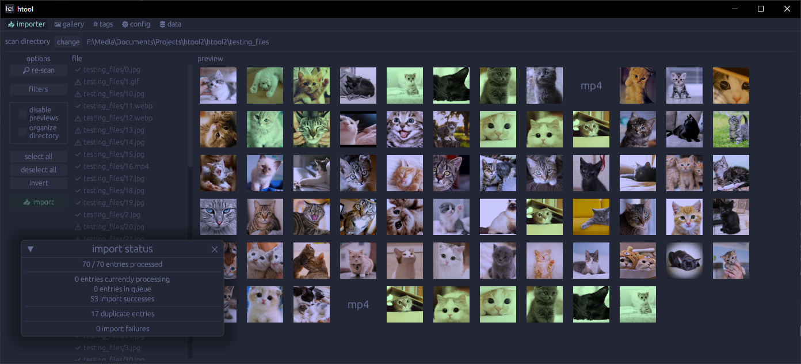
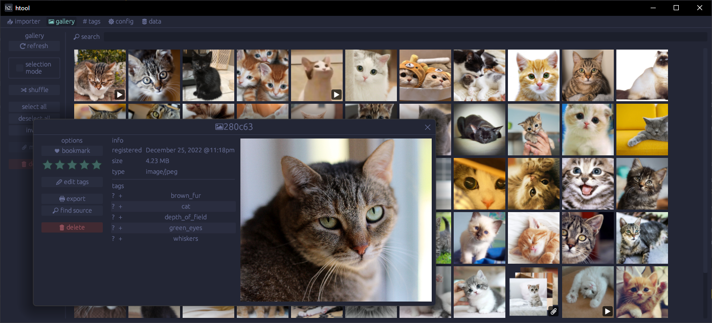
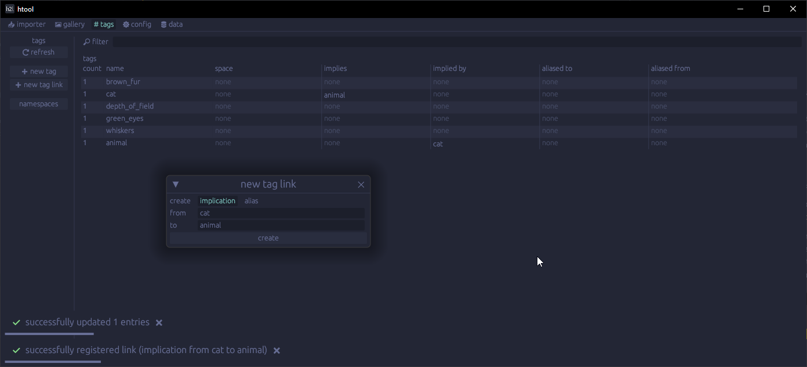
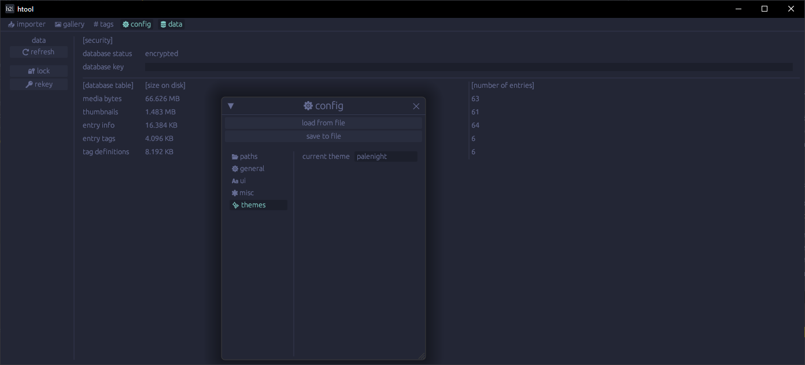
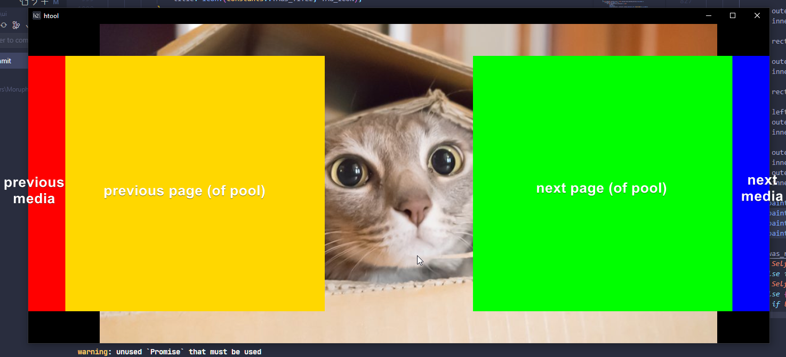

# htool
htool is a media management/gallery application with a focus on simplicity. 

🚧 htool is still in active development and should not be considered anywhere close to complete. do not use it without other copies of your media or you risk data loss from bugs. 🚧

## features
 - deduplication
 - tagging
  - immplications, aliases, namespaces
 - encryption
 - themeing

## screenshots

  
expand screenshots

  
  
  
  
  

## how to use
htool keeps all its data stored in a single sqlite database. when media is imported, the files are copied over to the database without affecting the original files at all. 

in the "importer" tab, you can select a folder to scan for media. most image formats are compatible with htool, and video support is WIP (no audio, iffy seeking). when trying to import an archive (`.zip`, `.rar`) or an inner directory, htool will import it as a "pool", keeping all contained media grouped together.

media can be viewed and modified in the "gallery" tab. in a preview window, double click the preview to enter (or exit) "fullscreen" (just fills the window of the application). while in fullscreen, the hovering/clicking edges of the window perform different actions.

  
expand fullscreen controls layout

  
  

 
 
## planned features
 - automatic backups
 - source finding
 - fuzzy deduplication
 - keybinds/hotkeys
 - better tab support
 - slideshow